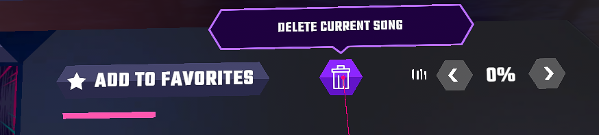

# Trashbin

Adds a button to delete songs for Synth Riders [PCVR]

## Setup
!After an update you might have to either grab the newest release of Trashbin or reinstall MelonLoader completely!

0. Backup your game files
1. Prepare Synth Riders for the use with mods by following the installation instructions for MelonLoader:  https://melonwiki.xyz/#/?id=automated-installation
2. Grab the newest version of Trashbin from releases and add it under ./SynthRiders/Mods (create new directory if not existent)
3. Profit?!

## Disclaimer
This mod is not related to Synth Riders Devs or Kluge Interactive.

Bin icon provided by [libertetstudio](https://www.iconfinder.com/icons/4243344/basic_bin_app_ux_icon)
